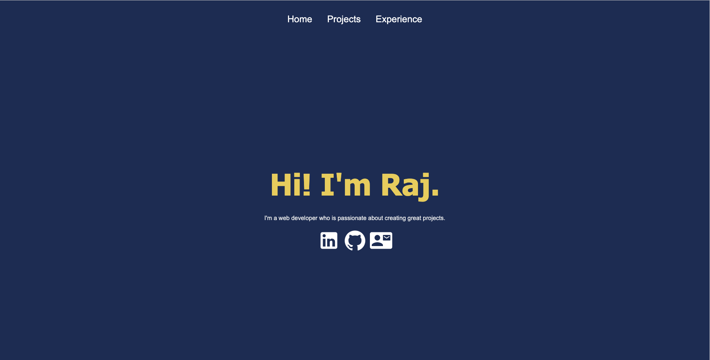
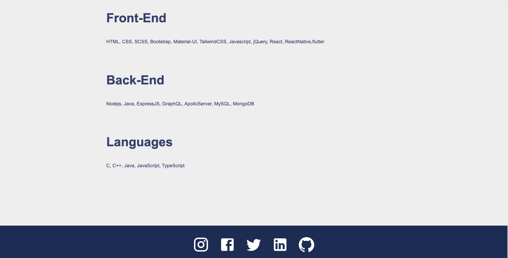
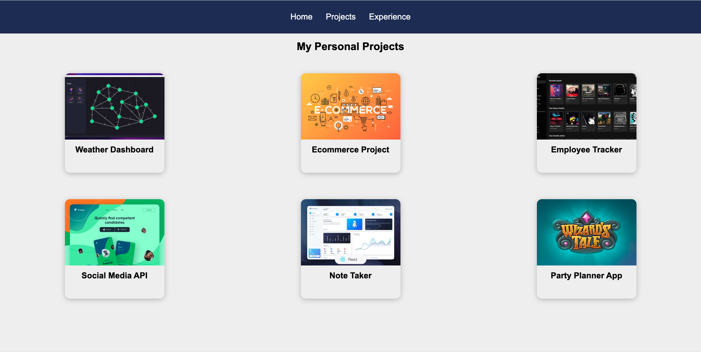
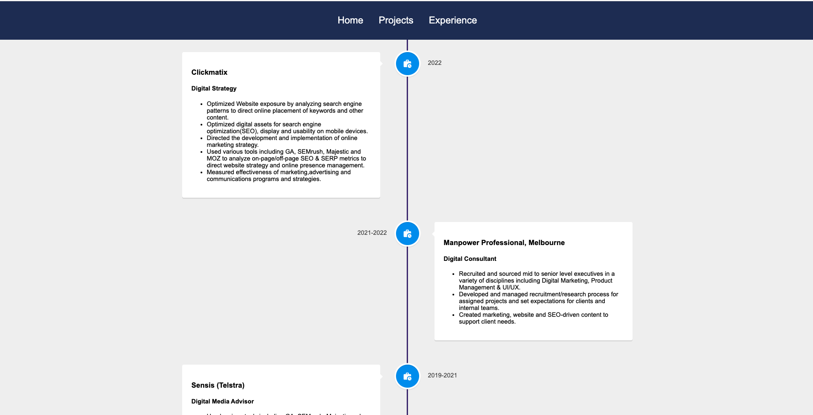

<h1 align="center">Hi 👋, I'm Raj Nori</h1>. 

<h1 align="center">Hi 👋, I'm Raj Nori</h1>. 

<h3 align="center">A passionate fullstack developer from Australia</h3>

  

  

- 🌱 I’m currently a **full stack web developer**

- 👨‍💻 All of my projects are available at [https://rajnori.github.io/Portfolio-project/](https://rajnori.github.io/Portfolio-project/)

- 📝 I regularly write articles on [https://rajnori.github.io/Portfolio-project/](https://rajnori.github.io/Portfolio-project/)

- 📫 How to reach me **contact@rajnori.com**

- ⚡ Fun fact **I love reading**

<h4># Portfolio-project

## Table of contents
* [General Info](#general-information)  
* [Technologies Used](#technologies-used)  
* [Motivation](#Motivation)  
* [Screenshots](#screenshots)  
* [Video](#video)    
* [Usage](#usage)  
* [Project Status](#project-status)  
* [Room for improvement](#room-for-improvement)  
* [Acknowledgement](#acknowledgement)  
* [Contact](#contact)  
* [Setup](#setup)

## General Information
A *portfolio project* to showcase my full-stack we development projects.

## Technologies Used 
> The portfolio project showcases our **Full Stack Web development** skills. It includes projects that include various technologies employed during our time at Monash Bootcamp. The following technolgoies and languages are employed in the projects   
  > `HTML`  

  > `CSS` . 

  > `Bootstrap`/ `Material-UI`/`SCSS` . 

  > `JavaScript` . 

  > `Node.js` . 

  > `Express middleware` . 

  > `SQL` . 

  > `Sequalize ORM` . 

  > `Mongodb` . 

  > `Mongoose ODM` . 
  
  > `React.js` . 

  > `GraphQL` . 

  > `MERN Stack` . 

  > `Apollo Server` . 

  
## Motivation

My motivation was to create a professional portfolio as a web developer where potential employers can view my profile and understand my capabilities a web developer.
 
I buit the project to create a friendly yet professional place online where both employers and peers can review and see my work.
Most employers do not like to look at a resume with bullet points on them, they want to get a feel for what the employee can bring to the table both skills wise as well as people and culture wise. 

# Screenshots

# video walkthrough

[Walkthrough](https://www.youtube.com/watch?v=4WWFcL6GBDY)

# usage
A portfolio page to showcase our skills and technologies so that employers evaluate our work and speed up the hiring process.

# Project Status
> Complete

# Room for improvement
> Can add peafures and create a mobile app.

# Acknowledgements

> I would like to thank the team at Monash bootcamp.

# contact
> Created by [@rajnori](https://rajnori.github.io/Portfolio-project/) - feel free to contact me by clicking on the link [here](https://rajnori.github.io/Portfolio-project/)!

# Setup
## Getting Started with Create React App

This project was bootstrapped with [Create React App](https://github.com/facebook/create-react-app).

## Available Scripts

In the project directory, you can run:

### `yarn start`

Runs the app in the development mode.\
Open [http://localhost:3000](http://localhost:3000) to view it in your browser.

The page will reload when you make changes.\
You may also see any lint errors in the console.

### `yarn test`

Launches the test runner in the interactive watch mode.\
See the section about [running tests](https://facebook.github.io/create-react-app/docs/running-tests) for more information.

### `yarn build`

Builds the app for production to the `build` folder.\
It correctly bundles React in production mode and optimizes the build for the best performance.

The build is minified and the filenames include the hashes.\
Your app is ready to be deployed!

See the section about [deployment](https://facebook.github.io/create-react-app/docs/deployment) for more information.

